# Analysis of Association Rules and Related Graphs
The following analysis was performed on the US_WEEK46_COVID.csv dataset. Each individual record in this dataset corresponds to a Covid-19 patient. 
Graphs relating to Covid-19 demographicand patient information, Long Covid-19 demographic and patient information, and association rules will be
interpreted and discussed. It must be noted that Covid-19 testing and treatment are not always 
accessible and could impact demographic results, as described [here](https://www.cadth.ca/sites/default/files/hs-eh/EH0096%20Long%20COVID%20v.7.0-Final.pdf).

## Covid-19 Graph Analysis
#### Distribution of Covid-19 Patient Ages
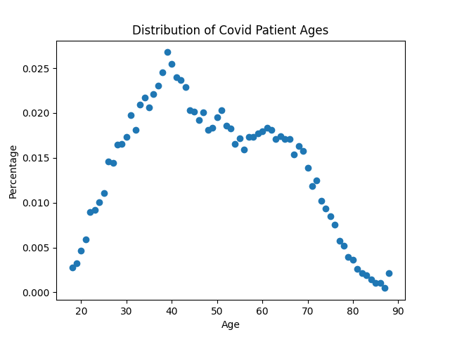   
The majority of Covid-19 patients in this dataset are in the 30-60 age range, as seen in the above graph. Individuals with Covid-19 younger than 30 and older than 
80 have the smallest percentages. 

#### Ratio of Covid-19 Patients Gender Assigned at Birth
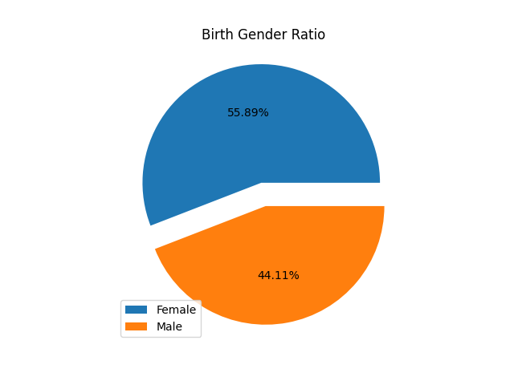        
According to the dataset analyzed, 55.89% of individuals were assigned female at birth, while 44.11% were assigned male at birth.
There is a higher percentage of individuals assigned female at birth who have Covid-19 in this dataset.  

#### Ratio of Covid-19 Patients Gender Identity
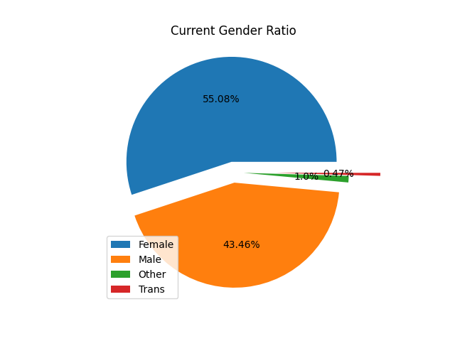   
As seen in the graph, 55.08% of patients currently identify as female. 43.46% of Covid-19 patients currently identify as male. 0.47% of patients currently identify
as transgender while 1.0% of patients identify as a different gender identity. There is still a higher percentage of female-identifying Covid-19 patients than 
male-identifying. 

#### Ratio of Covid-19 Patient Ethnicity
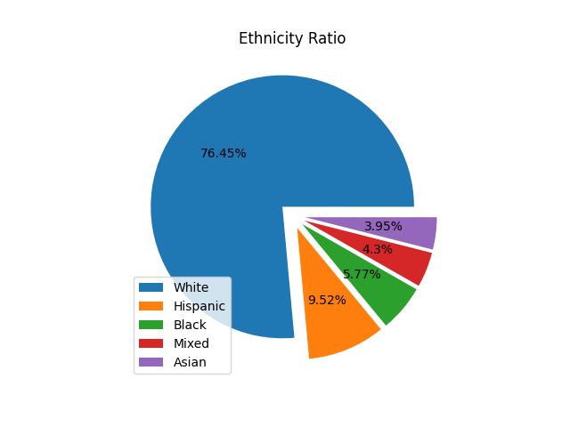     
In this dataset, patients identified their ethnicity based on 5 categories: white, hispanic, black, asian, and mixed. 76.45% of the Covid-19 patients
are white. 9.52% of the patients are hispanic. 5.77%  of the patients are black. 3.95% of the patients in this dataset are asian. 4.3% of patients are mixed. 
This graph shows that patients who are white make up the majority of the Covid-19 patients included in this dataset. 

#### Severity of Covid-19 Symptoms
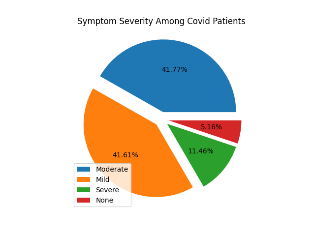   
The majority of Covid-19 patients reported mild or moderate symptoms, 41.61% and 41.77% respectively. Severe symptoms, like hospitalization, were reported by 11.46%
of Covid-19 patients in this dataset. Only 5.16% of Covid-19 patients in this dataset reported experincing no symptoms (considered asymptomatic).  

#### Vaccination Status Among Covid-19 Patients
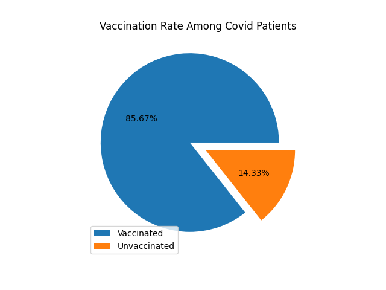   
Among the Covid-19 patients in this dataset, 85.67% are vaccinated (have recieved at least 1 vaccine) while 14.33% are unvaccinated.   

## Long Covid-19 Graph Analysis
#### Ratio of Covid-19 Patients with Long Covid-19
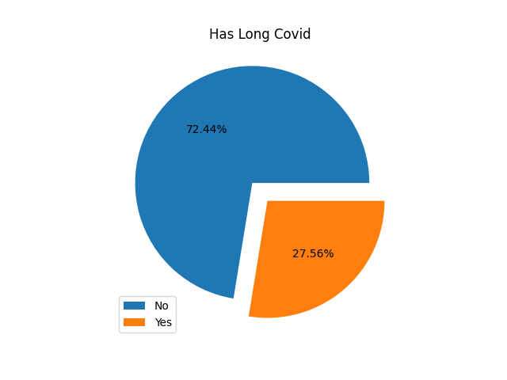   
72.44% of Covid-19 patients in this dataset reported not experiencing Long Covid-19, while 27.56% reported experiencing it. 

#### Distribution of Long Covid-19 Patient Ages
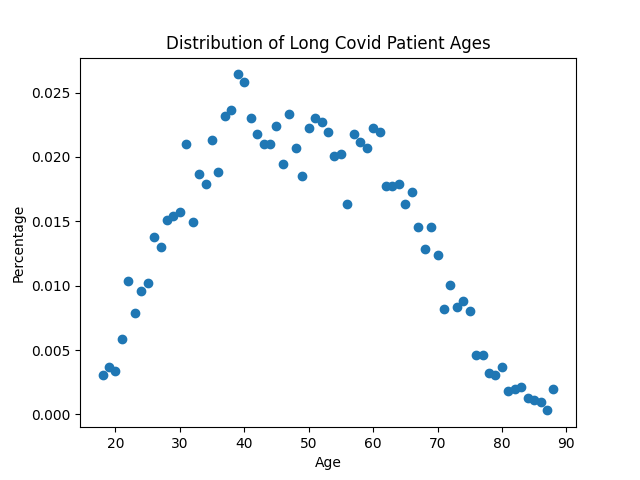   
Similarly to the ages of Covid-19 patients, the majority of individuals with Long Covid-19 are in the 30-60 age range. Again, individuals younger than 30 and older
than 80 have the smallest percentages.

#### Ratio of Long Covid-19 Patients Gender Assigned at Birth
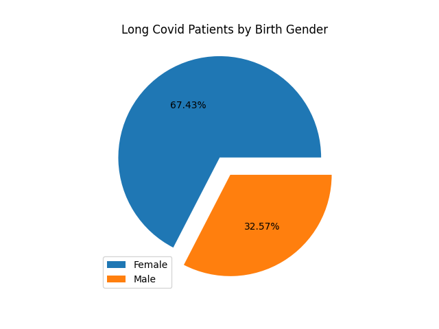   
Individuals assigned female at birth made up the majority of patients experiencing Long Covid-19 (67.43%). 32.57% of individuals assigned male at birth reported 
experiencing Long Covid-19. This could indicate that individuals assigned female at birth are more likely to develop Long Covid-19, but note that the dataset used 
contains a majority of individuals assigned female at birth. 

#### Ratio of Long Covid-19 Patients by Ethnicity
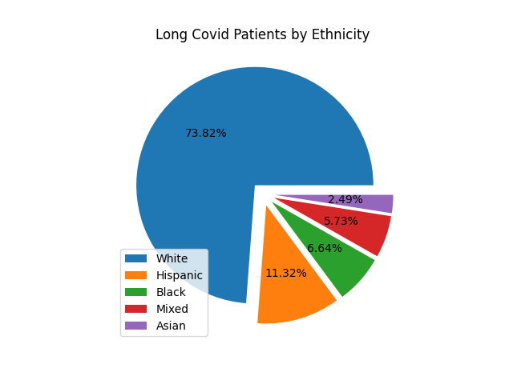   
Of the individuals reporting to have experienced Long Covid-19, 73.82% are white, 11.32% are hispanic, 6.64% are black, 5.73% are mixed, and 2.49% are asian. 
This could indicate that white individuals are more likely to experience Long Covid-19, however recall that 76.45% of the Covid-19 patients in this dataset are white
and that demographic information can be skewed by inaccessible testing and treatement. 

#### Ratio of Long Covid-19 Patients by Symptom Severity
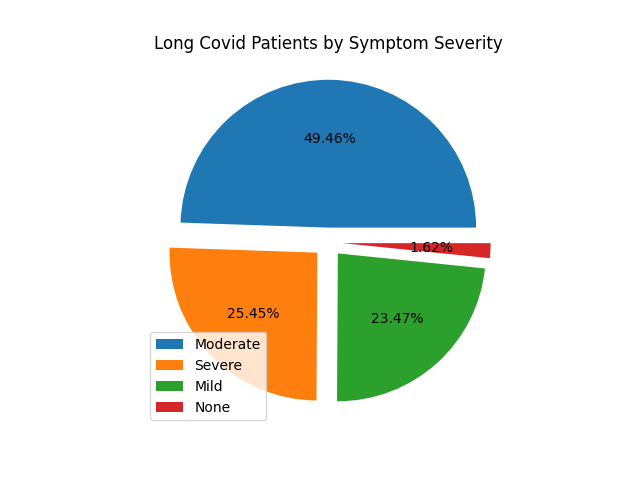   
The majority of individuals that reported having Long Covid-19 have moderate or severe symptoms, 49.46% and 25.45% respectively. 23.47% of individuals reported 
experiencing mild symptoms and 1.62% of individuals experiencing Long Covid-19 reported having no symptoms. Individuals reporting to have experienced Long Covid-19
with no symptoms could either be asymptomatic and testing positive for the required* amount of time to recieve a Long Covid-19 diagnosis, or part of the margin of error.   
*the required amount of time symptoms persist after initial diagnosis is debated among health organizations.
#### Ratio of Long Covid-19 Patients by Vaccination 
   
The majority of Long Covid-19 patients (84.6%) are vaccinated while 15.4% are unvaccinated. This could indicate that Long Covid-19 is more likely to develop
as a result of a breakthrough infection (infection of vaccinated individuals), though this would need further research.

## Association Rules
#### Confidence of Association Rules with 'Long Covid Occuring' as the Concequent
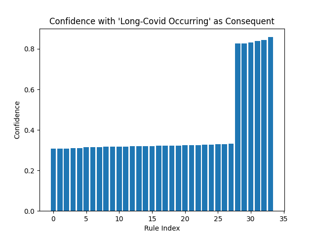   
An association rule with 'Long Covid Occuring' as the concequent is of the form: X->Long_Covid-Occuring. Approximately 33 interesting association rules were found that had 'Long
Covid Occuring' as the concequent. As indicated in the graph, the mined association rules are sorted by ascending confidence. The confidence of the association rules ranges from approximately 
0.3 to approximately 0.8.
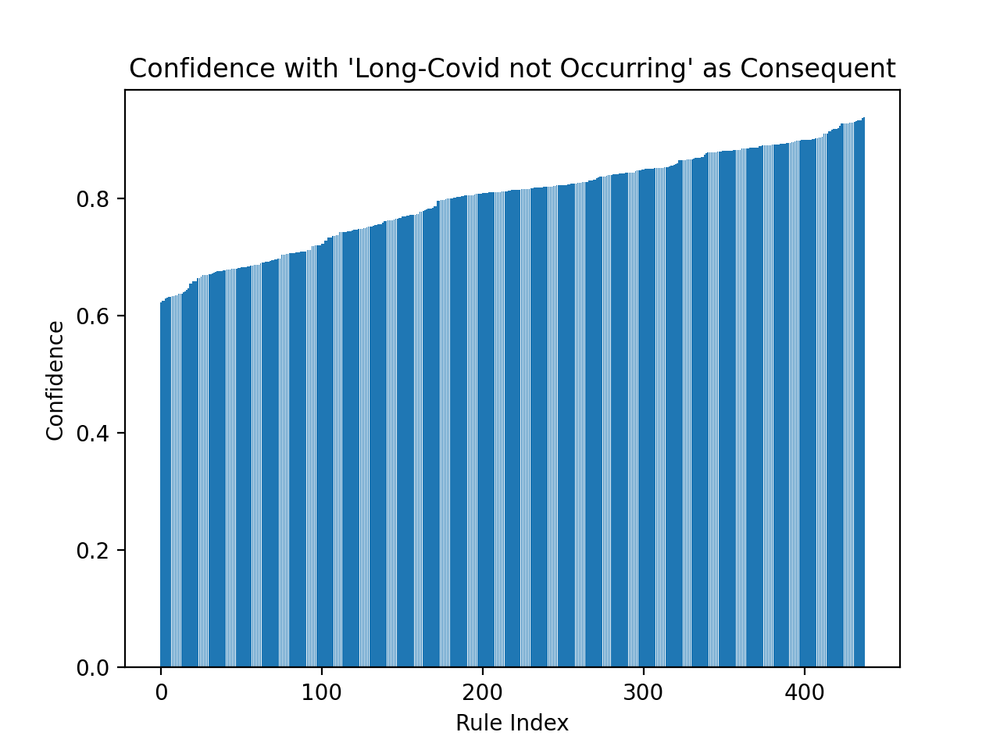   
Comparing the graphs with 'Long Covid Occuring' as the concequent and 'Long Covid Not Occuring' as the concequent, there are more association rules that have 'Long Covid
Not Occuring' as the concequent. Since 72.44% of Covid-19 patients in this dataset reported not experiencing Long Covid-19, it makes sense that more rules would be found with 'Long Covid not Occuring' as the concequent.
Over 400 rules were found with confidence ranging from approximately 0.6 to greater than 0.8. Again, the association rules found were sorted in ascending order by confidence.

#### Interesting Association Rules with Support and Confidence
| Rule Index  | Association Rule  | Support  | Confidence  |
| ----------- | ----------- |----------- | ----------- |
| 0       | (CURRENT GENDER_F, NUMBER DOSES_1.0, RACE_White) --> LONG COVID      | 0.10280095351609       | 0.307878633350331       |
| 1       | (CURRENT GENDER_F, NUMBER DOSES_1.0, VACCINATED_1, RACE_White) --> LONG COVID       | 0.10280095351609       | 0.307878633350331       |
| 2       | (CURRENT GENDER_F, NUMBER DOSES_1.0, BIRTH GENDER_F, RACE_White) --> LONG COVID       | 0.102502979737783       | 0.307928388746803       |
| 3       | (NUMBER DOSES_1.0, VACCINATED_1, BIRTH GENDER_F, RACE_White) --> LONG COVID       | 0.10518474374255       | 0.309532757108856       |
| 4       | (NUMBER DOSES_1.0, BIRTH GENDER_F, RACE_White) --> LONG COVID       | 0.10518474374255       | 0.309532757108856       |
| 5       | (CURRENT GENDER_F, RACE_White, VACCINATED_1) --> LONG COVID       | 0.111186786991316       | 0.314093314093314       |
| 6       | (CURRENT GENDER_F, VACCINATED_1, BIRTH GENDER_F, RACE_White) --> LONG COVID       | 0.110846245530393       | 0.314113389626055       |
| 7       | (VACCINATED_1, BIRTH GENDER_F, RACE_White) --> LONG COVID       | 0.113698280265622       | 0.315460021259005       |
| 8       | (CURRENT GENDER_F, NUMBER DOSES_1.0, BIRTH GENDER_F) --> LONG COVID       | 0.13847267154776       | 0.317211116528522       |
| 9       | (CURRENT GENDER_F, NUMBER DOSES_1.0, BIRTH GENDER_F, VACCINATED_1) --> LONG COVID       | 0.13847267154776       | 0.317211116528522       |
| 10       | (CURRENT GENDER_F, NUMBER DOSES_1.0) --> LONG COVID       | 0.138940916056529       | 0.31729367162438       |
| 11       | (CURRENT GENDER_F, NUMBER DOSES_1.0, VACCINATED_1) --> LONG COVID       | 0.138940916056529       | 0.31729367162438       |
| 12       | (NUMBER DOSES_1.0, BIRTH GENDER_F, VACCINATED_1) --> LONG COVID       | 0.142814575174527       | 0.319828408007626       |
| 13       | (NUMBER DOSES_1.0, BIRTH GENDER_F) --> LONG COVID       | 0.142814575174527       | 0.319828408007626       |
| 14       | (SYMPTOM SEVERITY_MODERATE, NUMBER DOSES_1.0) --> LONG COVID       | 0.109569215051932       | 0.319990054699154       |
| 15       | (SYMPTOM SEVERITY_MODERATE, NUMBER DOSES_1.0, VACCINATED_1) --> LONG COVID       | 0.109569215051932       | 0.319990054699154       |
| 16       | (CURRENT GENDER_F, RACE_White) --> LONG COVID       | 0.133449684999148       | 0.321538461538461       |
| 17       | (CURRENT GENDER_F, BIRTH GENDER_F, RACE_White) --> LONG COVID       | 0.133109143538225       | 0.321608557029723       |
| 18       | (BIRTH GENDER_F, RACE_White) --> LONG COVID       | 0.136301719734377       | 0.322684671974201       |
| 19       | (SYMPTOM SEVERITY_MODERATE, RACE_White) --> LONG COVID       | 0.103907713264089       | 0.322883597883597       |
| 20       | (CURRENT GENDER_F, BIRTH GENDER_F, VACCINATED_1) --> LONG COVID       | 0.151072705601907       | 0.323666210670314       |
| 21       | (CURRENT GENDER_F, VACCINATED_1) --> LONG COVID       | 0.151626085475906       | 0.323818181818181       |
| 22       | (SYMPTOM SEVERITY_MODERATE, VACCINATED_1) --> LONG COVID       | 0.117827345479312       | 0.324806383478056       |
| 23       | (BIRTH GENDER_F, VACCINATED_1) --> LONG COVID       | 0.155840286054827       | 0.326059850374064       |
| 24       | (SYMPTOM SEVERITY_MODERATE) --> LONG COVID       | 0.136174016686531       | 0.328035274815422       |
| 25       | (CURRENT GENDER_F, BIRTH GENDER_F) --> LONG COVID       | 0.180401838923888       | 0.330603011155316       |
| 26       | (CURRENT GENDER_F) --> LONG COVID       | 0.180955218797888       | 0.330662725575606       |
| 27       | (BIRTH GENDER_F) --> LONG COVID       | 0.185850502298654       | 0.332520944402132       |
| 28       | (CURRENT SYMPTOMS_YES, NUMBER DOSES_1.0, VACCINATED_1) --> LONG COVID       | 0.118167886940234       | 0.827421758569299       |
| 29       | (CURRENT SYMPTOMS_YES, NUMBER DOSES_1.0) --> LONG COVID       | 0.118167886940234       | 0.827421758569299       |
| 30       | (CURRENT SYMPTOMS_YES, VACCINATED_1) --> LONG COVID       | 0.127490209432998       | 0.832406892718176       |
| 31       | (CURRENT SYMPTOMS_YES, RACE_White) --> LONG COVID       | 0.111910437595777       | 0.838329081632653       |
| 32       | (CURRENT SYMPTOMS_YES) --> LONG COVID       | 0.147709858675293       | 0.844282238442822       |
| 33       | (CURRENT SYMPTOMS_YES, BIRTH GENDER_F) --> LONG COVID       | 0.101779329133321       | 0.857911733046286       |
