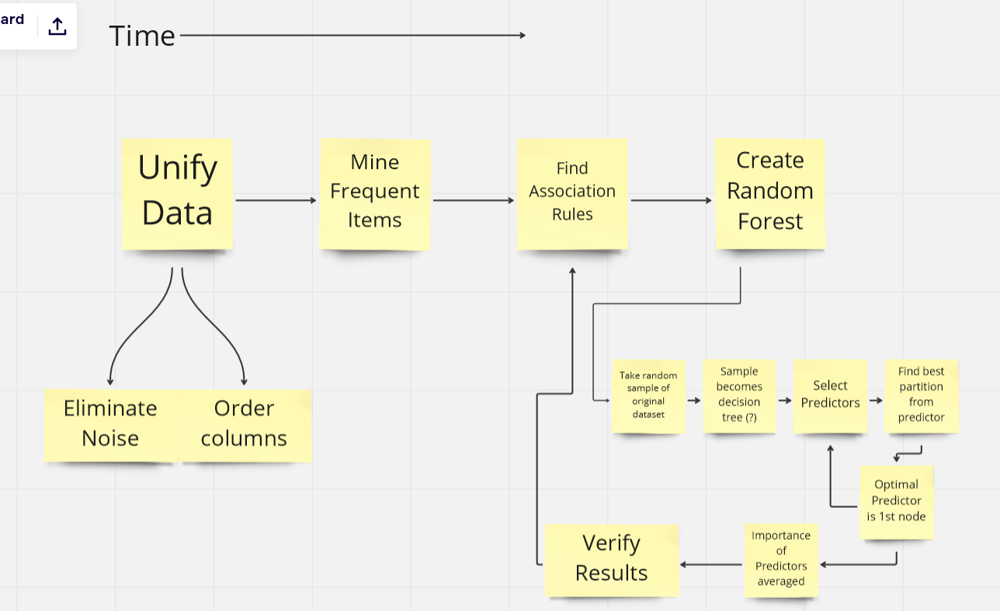

# COMP4710-Group-11

## TODO
- Decide how assocation rules and random forest are connected
  - Association rules for analysis part of paper, then random forest for prediction?
  - Decide on order of implementation: data mining then prediciton? or vise versa
- Choose algorithm to mine data
- What are the main areas of work, and how will we divide the work among the group
  - Compile all datasets into CSV/spreadsheet for use in project and submiting
    - is this even necessary?
  - Implement data mining algorithm
  - Implement random forest algorithm
  - Perform analysis on dataset, association rules, and results of prediction algorithm
  - Write report (10 page minimum using [IEEE template 2-column](https://www.ieee.org/conferences/publishing/templates.html))
  - Presentation (video or live powerpoint)  

## Data sources
- [Harvard Long Covid Dataset](https://dataverse.harvard.edu/dataset.xhtml?persistentId=doi:10.7910/DVN/N5I10C%0b)
- [Another Long Covid Dataset](https://data.humdata.org/dataset/long-covidresearchagenda)
- [UK Omnicron Variant Long Covid Dataset](https://www.ons.gov.uk/peoplepopulationandcommunity/healthandsocialcare/conditionsanddiseases/datasets/selfreportedlongcovidafterinfectionwiththeomicronvariantintheuk%0b)
- [Demographic Suceptability Dataset](https://data.cdc.gov/NCHS/Post-COVID-Conditions/gsea-w83j%0b)
## Research
- [Long Covid Symptoms Research](https://www.ejinme.com/article/S0953-6205(21)00208-9/fulltext)
- [Comprehensive Overview of Post Covid Condition](https://www.cadth.ca/sites/default/files/hs-eh/EH0096%20Long%20COVID%20v.7.0-Final.pdf )
- [Explaining Random Forest Using Association Rules]( https://publikationen.bibliothek.kit.edu/1000117720/62928283)
- [Random Forests](https://www.researchgate.net/publication/323553514_A_Practical_Introduction_to_Random_Forest_for_Genetic_Association_Studies_in_Ecology_and_Evolution )
