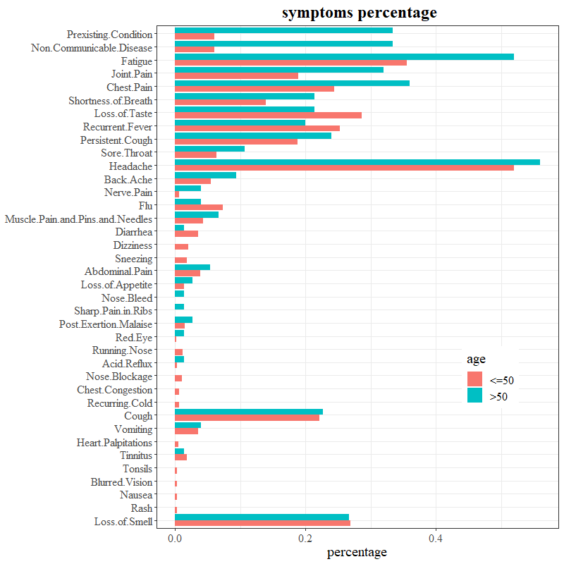
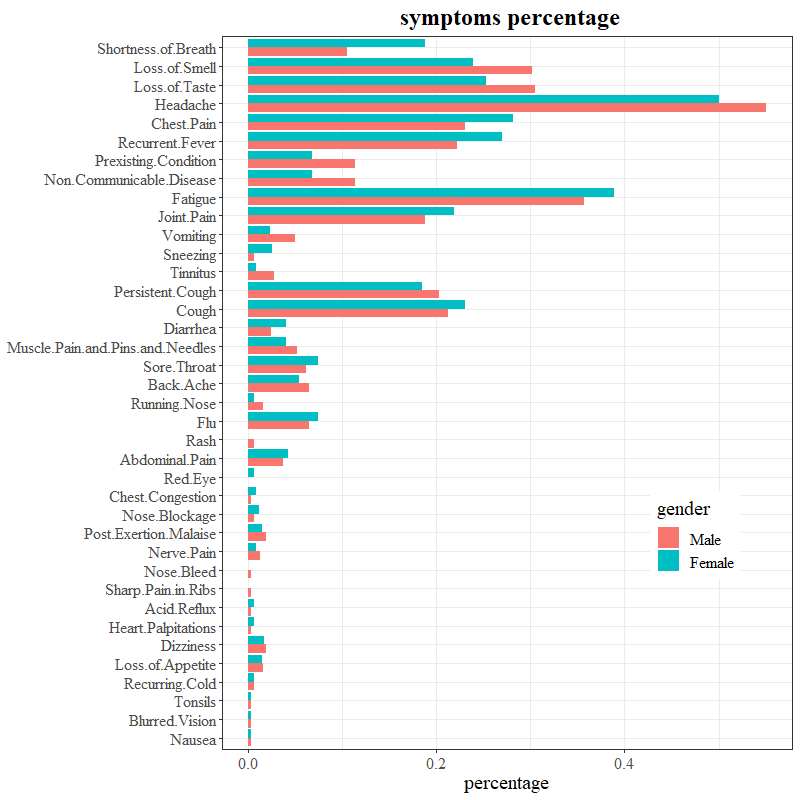
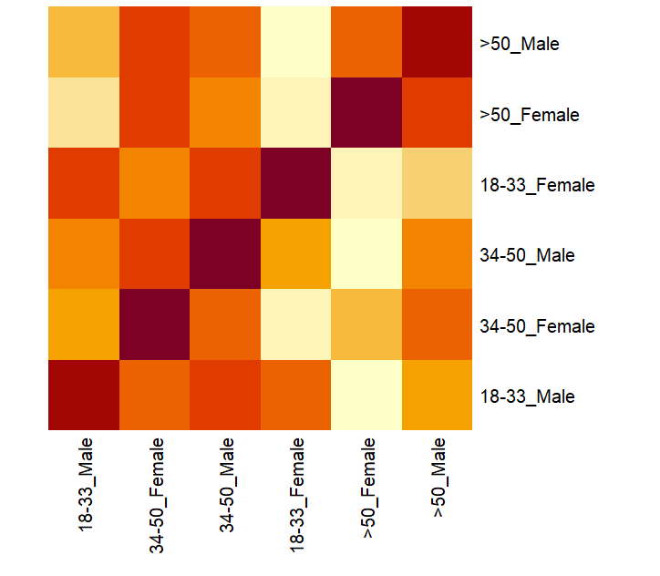
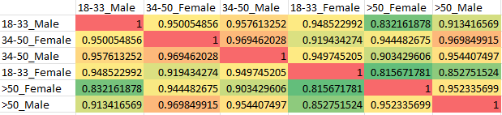
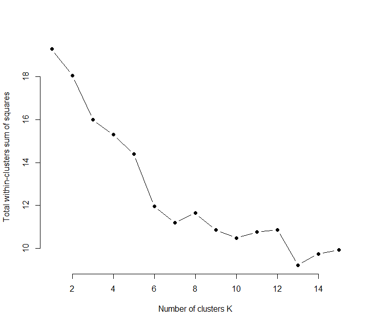
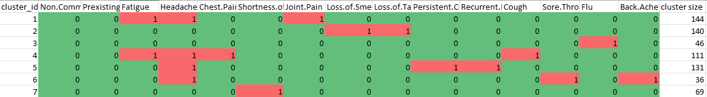

# subgroup statistics and clustering for Kenya data
The following analysis was performed on the Kenya.csv data. More analysis will be available for the Malawi data as well as the US_WEKK46_COVID.csv data. All graphic and table result can be found in "clustering_result.xlsx"

## The age/gender sub groups statistics
### Comparison of frequencies of post COVID symptoms between two age groups (ordered by differences)

- for age group > 50 years old, the symptoms of "Preixsting condition", "Non communicatable disease" and "Fatigue" are much more prevalent that the younger group. This is reasonable because of the bias of the age.
- Some symptoms occured more in group of <=50 years old, such as "Diarrhea", "Loss of Taste". 
- chi-square test will be performed on those symptoms that varies significantly between the age groups. For most of the symptoms, the frequencies between the two age groups are not significant.

### Comparison of frequencies of post COVID symptoms between two gender groups (ordered by the level of differences)

- The deviances for most of the symptom freqencies between the two given genders are not significant.
- Some symptoms are more prevalant in females, for example, "Shortness of Breath", "Chest Pain" and "Recurrent Fever".
- Some symptoms are more prevalant in males, such as "Loss of Smell". "Loss of Taste" and "Heahache".
- p-values of those significances will be added.

## The frequencies similarities among the six age/gender combo subgroups:

- First we omit the symptoms that have 0 positive reports, which reduced the number of symptoms from 45 to 38.
- For each age/gender subgroups (age: 18-34; 35-50; >50; gender: Male; Female), and for each symptoms, we computed the frequencies and percentage of the positive reports. Then each subgroup has a vector of occurance percentages for the symptoms. 
- Then we compute the cosine similarities among the 6 subgroups, resulting a 6*6 table for similarities. The table below shows the value of cosine similarity matrix.

## The k-mode clustering analysis and age/gender subgroup mapping
- We further reduced the number symptoms with the threshold of 5% for clustering analysis, this result in 15 symptoms. Since all the symptoms are categorical variable (either 0 or 1), we performed a k-mode analysis.
- First we optimize the number of clusters within the datset with metric of Total-of-within-cluster-sum-of-square (a measurement of the compactness within a cluster). We choose at the elbow point when k=7, as shown below by the optimization path.

The modes of the 7 clusters:

Then we mapped those clusters with the three age groups (there is no significant difference between the two gender groups), and it shows that the clusters did not fit well with the age groups, though we concentrations can be observed, for example, age>50 group only has 75 cases, but they mainly clustered in cluster 1,2,4 and 5.

|cluster_id |	18-33|	34-50|	>50|
|-----------|--------|-------|-----|
|1	|60	|61	|23|
|2	|76	|52	|12|
|3	|35	|8	|3|
|4	|53	|47	|11|
|5	|64	|53	|14|
|6	|9	|20	|7|
|7	|29	|35	|5|
